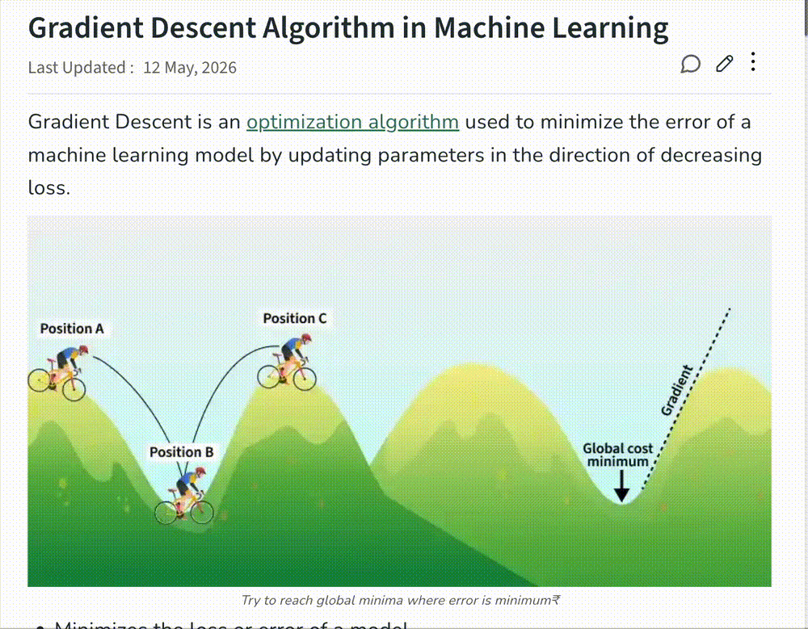

# Context Lens

A Chrome extension that explains selected text **based on what the selection actually is**.
Select a term on a page, click **Explain**, and get an explanation shaped for that kind of
thing — a technical term gets a technical answer, a citation gets its source located, a
formula gets its symbols broken down.

## Demo



## Architecture

```
  ┌── content script ────────────┐        ┌── service worker ───────────────────────┐
  │                              │        │                                          │
  │  1. Selection                │        │  3. Heuristics                           │
  │     mouseup / ⌘⇧E            │        │     code / formula / citation → category │
  │        │                     │        │        │                                 │
  │  2. Context extraction       │──port─►│  4. ONE streamed call                    │
  │     headings, surrounding    │        │     known category → that answer shape   │
  │     text, code block, meta   │        │     ambiguous → CATEGORY line, then      │
  │        │                     │        │                 the explanation          │
  │  5. Popup (shadow DOM)       │◄─────── │                                          │
  │     opens on click, labels   │ category│                                          │
  │     itself, streams tokens   │ deltas  │                                          │
  └──────────────────────────────┘  done   └──────────────────────────────────────────┘
```

**Why the stages sit where they do**

- **Context extraction runs in the content script** — it is the only side with a DOM.
  Measured at 0.02–0.16 ms, including on a 10,890-node Wikipedia article, so it is free.
  It collects headings above the selection, the surrounding paragraph clipped to ±700
  characters, whether the selection is inside `<pre>/<code>`, and the code language from
  the highlighter's class names.
- **Heuristics run first and are worth more than the tokens they save.** When the DOM
  already answers the question — a selection inside a code block, LaTeX, a citation
  marker — the popup can render the category label before the network is touched at all.
- **Classification and explanation are one call.** For ambiguous selections the model
  emits `CATEGORY: <label>` as the first line of the same response it explains in. The
  label lands in the first few tokens, so the popup still identifies itself almost
  immediately, and there is no second sequential round trip.
- **The popup streams.** It opens on click with the selection already in it, swaps in the
  category when known, and appends prose as it is generated. There is no state in which
  the user is looking at a bare spinner.
- **The API key lives in the service worker.** The content script never sees it.

## Repository structure

```
src/
  manifest.json          MV3 manifest
  content/
    index.js             pipeline entry: selection → context → transport → popup
    transport.js         the port protocol and every way it can fail
    selection.js         reads window.getSelection() and its screen rect
    context.js           stage 2 — page context extraction (DOM only)
    math.js              recovers a formula's own source from rendered math
    popup.js             stage 5 — floating chip + streaming panel, closed shadow root
  background/
    index.js             service worker: port lifecycle, settings, error mapping
    explain.js           stage 4 — the single streamed call + CATEGORY-line parser
    classify.js          stage 3 — heuristics only
    anthropic.js         SDK client construction
    cache.js             chrome.storage.session memo, so a re-select is instant
  skills/
    index.js             the router (category → skill), and shape assembly
    shapes.js            what a good answer looks like, per category
    technical-term.js    the one dedicated skill
    prompt.js            known-category and triage prompt builders
  shared/
    categories.js        the category enum — single source of truth
    models.js            model tiers and their per-model request params
    messages.js          content ↔ worker channel constants
    settings.js          chrome.storage wrapper
  options/               API key, model tier, target language
test/
  pipeline.test.mjs      heuristics, routing, prompt assembly
  stream.test.mjs        CATEGORY-line parsing + explain() over a fake stream
  messaging.test.mjs     port failure modes against a fake chrome.runtime
  math.test.mjs          the formula-source ladder
bench/latency.mjs        live per-stage latency measurement, old path vs new
build.mjs                esbuild: content → IIFE, worker → ESM
```

## Install

```bash
npm install && npm run build
```

Then in Chrome: `chrome://extensions` → enable **Developer mode** → **Load unpacked** →
select the `dist/` folder. Open the extension's options page and paste an Anthropic API
key.

Use it: select text on any page, click the **Explain** chip, or press ⌘⇧E / Ctrl⇧E.

`npm run watch` rebuilds on save; click the reload icon on the extension card to pick
changes up. `npm test` runs the offline suite. `npm run bench` measures real latency —
it needs `ANTHROPIC_API_KEY` and makes live calls.

## The port protocol

The content script talks to the worker over a named port (`context-lens/explain`),
because streaming needs a channel that stays open. The worker replies with an **ack the
instant `onConnect` fires**, before touching settings or the network. That ack is what
lets the content script tell "the worker never accepted the port" apart from "the answer
is still coming" — without it, both look identical and the popup hangs.

Every failure ends in a visible message with a suggested action, never a stuck
`Identifying`:

| Failure | Detected by | What the reader sees |
| --- | --- | --- |
| Extension reloaded while the tab was open | `connect()` throws, or `lastError` says "context invalidated" | reload the page |
| Worker never accepted the port | no ack within 3s, or immediate disconnect | reload, and check `chrome://extensions` |
| Accepted, then silence | no further event within 25s | timed out |
| Port dropped mid-answer | disconnect after an ack | connection closed early; partial text is kept |

`onDisconnect` reads `chrome.runtime.lastError`. That is not optional bookkeeping: not
reading it is what produces `Unchecked runtime.lastError: Could not establish connection.
Receiving end does not exist.` in the page console, and it is the only place the real
reason is available.

An orphaned content script — one that outlived its extension because the extension was
reloaded or updated while the tab was open — is unrecoverable in that tab. The transport
remembers it and fails subsequent requests immediately instead of retrying a connection
that cannot succeed.

`transport.js` holds this logic with the DOM kept out, so `test/messaging.test.mjs` can
drive all of it against a fake `chrome.runtime`.

## Tracing the messaging path

Both bundles carry a build id, printed by `npm run build` and stamped into every trace
line. That is the fastest way to tell whether a tab is running the bundle you just built:

```
npm run build          # prints e.g. "build id 20260905T010844"
```

Then, on any page where the extension is active, open DevTools and check:

- **Page console** — `__contextLensBuild` returns the id the content script was built
  with. A different id (or `undefined`) means Chrome is not loading the `dist/` you just
  built: check the path on the `chrome://extensions` card, and that no second copy of the
  extension is installed.
- **Worker console** — open it from the extension's card ("service worker"). It logs
  `0. worker script evaluated` with the same id at startup.

With both consoles open, one explanation prints a numbered trace across the two sides:
content `0` → `1. startExplain` → `3. runtime.connect` → `4. port created` →
`5. ack timer armed` → `6. start message posted`, worker `5. onConnect` → `6w. ack posted`
→ `7w. port message` → `8. Anthropic request starting` → `9w. first stream event`, content
`7. ACK received` → `9. first stream event` → `9d. done`. Any failure prints
`10. TIMEOUT fired`, `11. port disconnected` or `12. FAILURE surfaced to popup`.

Where the trace stops is the answer:

| Last line seen | Meaning |
| --- | --- |
| nothing at all | the content script is not injected, or the tab predates the extension |
| `1. startExplain` with no `2.` | the popup opened but the transport was never reached |
| `6. start message posted`, no worker output | the worker is not running this build, or never started |
| worker `5. onConnect` but no `6w.` | the port died between connect and ack |
| `8.` with no `9w.` | the request left the extension and Anthropic has not answered |

The tracing is temporary. To remove it, delete `src/shared/debug.js` and its `trace(...)`
call sites.

## Latency

The pipeline was rebuilt around time-to-first-useful-pixel. Where the time was going:

| Stage | Old | Now |
| --- | --- | --- |
| Selection + context extraction | 0.02–0.16 ms (measured) | unchanged |
| Wake the service worker | on the critical path | pre-warmed when the chip appears |
| Classification | separate Haiku round trip | free (heuristic) or fused into the explanation |
| Explanation | Opus 5, thinking on, non-streaming | Haiku 4.5, no thinking, streamed |
| First thing on screen | the finished answer, or nothing | panel on click → category → tokens |

Input size was never the problem: the whole request is ~800 tokens. The cost was two
sequential round trips, a frontier model thinking before answering, and a non-streaming
response, which together make time-to-first-token identical to time-to-last-token.

Per-model request params are not interchangeable, and getting them wrong is a 400 rather
than a slowdown — see `src/shared/models.js`. Haiku 4.5 takes no `effort` parameter and
does no thinking unless given a budget. Sonnet 5 accepts disabled thinking, which is the
right call for a popup answer with no tools in play. Opus 5 keeps thinking on at low
effort, because turning it off on that model has known failure modes.

`fallbacks: "default"` (server-side refusal fallback) was dropped: it lives on the beta
messages namespace, which has no streaming helper in SDK 0.71.x. Streaming is worth more
here than automatic refusal recovery on "what does this word mean". Refusals are still
detected and surfaced.

## What is implemented

Every stage of the pipeline is real. One skill is authored end to end.

| Category | How it is identified | Answer shape |
| --- | --- | --- |
| code | heuristic — code block or syntax | `shapes.js` |
| formulas | heuristic — recovered math source, else LaTeX / math symbols | `shapes.js` |
| citations | heuristic — `[12]`, `et al.`, `doi:` | `shapes.js` |
| technical terms | model, in the explanation call | **`technical-term.js`** |
| vocabulary | model, in the explanation call | `shapes.js` |
| people / companies | model, in the explanation call | `shapes.js` |

`shapes.js` holds a one-line answer shape per category. Registering a real skill module
replaces its entry everywhere at once — in the known-category prompt and in the triage
prompt, which is assembled from every shape.

## Formula source recovery

For formulas the selected text is not just incomplete when a reader grabs part of an
equation — it is frequently **wrong even when they select the whole thing**, because what
gets selected is the rendered glyphs, not the formula. Measured on live pages:

| Page | Actual formula | What `getSelection()` returns |
| --- | --- | --- |
| katex.org | `\KaTeX` | `KaTeX K A T E ​ X` — doubled, MathML and HTML branches both selected, plus a zero-width space |
| Wikipedia | `E=mc^{2}` | `𝐸 = 𝑚 𝑐 2` — **the superscript is gone** |
| mathjax.org | `\frac{-b\pm\sqrt{b^2-4ac}}{2a}` | `𝑥=−𝑏±√𝑏2−4⁢𝑎⁢𝑐2⁢𝑎` — **the fraction is flattened**, numerator and denominator run together |

So when a selection lands in rendered math, `content/math.js` ignores the selection and
takes the page's own source, walking a ladder of what renderers actually publish:

1. `annotation[encoding="application/x-tex"]` — KaTeX, Wikipedia, LaTeXML/arXiv, MathJax with MathML output
2. `math[alttext]` — Wikipedia, LaTeXML
3. `script[type="math/tex"]` — MathJax v2
4. `data-latex` / `data-tex` attributes
5. Wikipedia's image-fallback `alt` text, when it looks like TeX
6. MathML — structured and unambiguous, just not TeX
7. `data-semantic-speech-none` / `aria-label` — the renderer's own structural reading

Verified live: rung 1 on katex.org and Wikipedia, rung 7 on mathjax.org. Because the whole
container is read, a partial selection recovers the complete formula — and the prompt is
told the selection was partial so the model explains the whole thing.

Rung 7 is the interesting one. **MathJax v3/v4 with CHTML output publishes no source in
the DOM at all** — no annotation, no assistive MathML, no data attribute. Its speech
attribute ("x equals the fraction with numerator negative b plus or minus...") is prose
rather than TeX, but it is structurally complete, which flattened Unicode is not. The
`format` is passed to the model so it knows what it is reading.

A recovered source also settles the category: `heuristicCategory` returns `formula`
whenever one exists, which beats any pattern match on mangled glyphs and costs nothing.

## Security

The API key is stored in `chrome.storage.local` and sent from the extension directly to
`api.anthropic.com`. That is acceptable for personal use, but anyone with access to the
browser profile can read it, and a shipped product should proxy requests through a server
that holds the key instead — the only change needed is swapping `background/anthropic.js`
for a `fetch` to your endpoint.

## Known gaps

- The transport is verified against a fake runtime, and the built worker is verified to
  load and register `onConnect` in a browser environment. Neither is a substitute for
  loading the unpacked extension in Chrome.
- MathJax v3/v4 CHTML pages fall back to the speech attribute. The real TeX is reachable
  through MathJax's own JS API (`MathJax.startup.document.math`), but only from the page's
  main world — a content script runs isolated. That would need `world: "MAIN"` injection.
- The five placeholder answer shapes are one line each. Real skills will want more, and
  citations in particular will need web search to actually *locate* a source.
- Near the bottom of the viewport the panel is anchored above the selection using its
  height at open time, and re-anchored once when streaming finishes. It can overhang
  briefly while growing.
- `heuristicCategory` never fires for prose, so every vocabulary/entity/technical-term
  selection still costs one model call. A local frequency list could answer the easiest
  vocabulary lookups with no call at all.
- The heading trail walks direct siblings only, so it misses wrapper-wrapped headings —
  Wikipedia returns an empty trail. Measured, not yet fixed.
